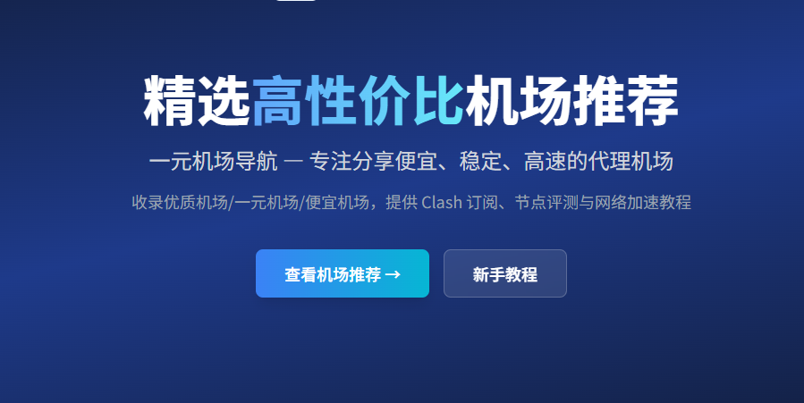

# 🔰 杨帆云 — 高性价比机场推荐与科学上网指南

> **杨帆云推荐 · 便宜机场 · 稳定机场 · Clash机场 · Shadowrocket机场 · V2Ray机场 —— 一站收录**

*杨帆云首页，收录主流实惠机场与使用教程*

---

## 📑 目录

- [什么是杨帆云](#-什么是杨帆云)
- [如何选择稳定的杨帆云](#-如何选择稳定的杨帆云)
- [杨帆云适合哪些用户](#-杨帆云适合哪些用户)
- [Clash、Shadowrocket 如何使用机场订阅](#-clashshadowrocket-如何使用机场订阅)
- [如何判断机场是否稳定](#-如何判断机场是否稳定)
- [机场推荐列表](#-机场推荐列表)
- [最新评测](#-最新评测)
- [新手教程](#-新手教程)
- [常见问题 FAQ](#-常见问题-faq)
- [热门搜索](#-热门搜索)
- [推荐阅读](#-推荐阅读)

---

## 📖 什么是杨帆云

"杨帆云"这个词在最近几年越来越频繁地出现在需要翻墙上网的用户视野中。很多第一次接触的人会好奇：杨帆云到底是什么？为什么叫"机场"？价格为什么能这么低？靠不靠谱？带着这些问题，我们从头聊起。

### 为什么叫"机场"

科学上网圈子里，"机场"这个说法最早来自 V2Ray 社区。V2Ray 的传输协议用一种叫做 VMess 的加密方式，而 VMess 的读音和 "we mess" 有点像——但更广为流传的解释是：**飞机场是飞机起飞的地方，而飞机（代理节点）从机场起飞，带你飞越网络封锁，访问外面的世界**。这个比喻很形象，于是"机场"就成了代理服务提供商的代名词。

一个"机场"本质上就是一个提供代理节点的服务平台。你付费购买套餐后，会获得一个订阅地址（也叫订阅链接），把这个地址导入到 Clash、Shadowrocket、Sing-box 等客户端软件里，就能看到几十甚至上百个分布在全世界各地的节点，一键连接使用。

### 杨帆云的特点

所谓"杨帆云"，并不是说所有套餐都是一块钱。这个词更多代表一类**以极低价格为卖点**的机场服务。它们的典型特征是：

- **入门价格低**：月付通常在 ¥5~¥15 左右，有的甚至低至 ¥1 试用
- **节点数量不少**：虽然便宜，但节点数量反而可能很多，30~80 个不等
- **协议以 SS/SSR/V2Ray 为主**：便宜机场通常用 Shadowsocks 或 V2Ray 协议，成本更低
- **线路以直连为主**：一分钱一分货，低价机场大多使用直连线路而非专线

之前有人担心杨帆云能不能用，这个问题其实要分需求来看。如果你只是用来刷刷 Instagram、看看 Twitter、查查 Google，那杨帆云完全够用。但如果你需要看 4K Netflix、玩低延迟游戏，那就需要选择线路更好的中高端机场了。

### 杨帆云的优缺点

| 方面 | 优点 | 缺点 |
|------|------|------|
| 💰 价格 | 月付仅需几块钱，学生党无压力 | 套餐流量通常较少 |
| 📡 节点 | 节点数量多，选择丰富 | 直连线路，晚高峰可能降速 |
| 🔓 流媒体 | 部分节点能解锁 Netflix/ChatGPT | 解锁不稳定，节点经常变动 |
| 🛠 协议 | 支持 V2Ray/SS/SSR 等主流协议 | 高端协议支持较少 |
| 💬 客服 | 一般有 Telegram 群组 | 响应速度不如高端机场 |
| ⏱ 稳定性 | 日常使用没问题 | 高峰期可能波动 |

用一句话总结：**一分钱一分货，但杨帆云的性价比确实高**。对于预算有限但对网络质量要求不高的用户来说，它是最经济的选择。

> 💡 **建议**：如果你是第一次购买机场，可以先从一个便宜的套餐入手试试水，体验一下速度、稳定性和客服水平，满意了再续费。

*图中展示了从用户设备通过机场节点访问全球互联网的示意图，节点分布在亚洲、欧洲和美洲*

---

## 🔍 如何选择稳定的杨帆云

市面上的低价机场越来越多，价格从几块钱到几十块不等，质量也是良莠不齐。有些跑路、有些限速、有些节点三天两头换——那到底**杨帆云哪个好**？怎么选到**稳定机场**？下面分享几个实用的挑选标准。

### 节点稳定性

这是最核心的指标。一个再便宜的机场，如果节点经常连不上、或者隔两天全部换一遍，那体验会很差。

判断方法：
- ✅ 看节点存活时间：节点列表里的节点是否长期存在
- ✅ 看延迟抖动：不是只看 ping 值，要看晚高峰的延迟波动
- ✅ 看断流情况：打开网页是否偶尔转圈

建议先买月付套餐测试，用个一两周就能感受到稳定性。不要一上来就买年付。

### 线路类型

机场的线路通常分三种：

| 线路类型 | 成本 | 速度 | 晚高峰 | 代表机场 |
|---------|------|------|--------|---------|
| 🔵 直连 | 低 | 一般 | 明显降速 | 大部分杨帆云 |
| 🟢 中转（BGP） | 中 | 好 | 轻微影响 | 进阶级机场 |
| 🟣 专线（IEPL/IPLC） | 高 | 极好 | 无影响 | 旗舰级机场 |

杨帆云基本上是直连或部分中转线路。如果预算允许，建议选至少带中转线路的套餐，晚高峰体验会好很多。

### 流媒体解锁能力

很多人买机场不只是为了翻墙，还为了看 Netflix、Disney+、YouTube Premium，或者使用 ChatGPT、Claude。

流媒体解锁分几种情况：
- **Netflix 解锁**：不是所有节点都能看 Netflix，需要专门解锁
- **ChatGPT 解锁**：OpenAI 对 IP 有严格限制，很多机场节点被屏蔽
- **TikTok 解锁**：部分地区节点可能需要单独设置

选购前可以看机场的介绍页面是否标注了流媒体解锁情况，或者直接咨询客服。

### 客服响应速度

低价机场的客服通常没有 24 小时在线支持，大部分通过 Telegram 群组回答问题。好的机场群组里，管理员回复速度快、态度好；差的机场群里全是用户吐槽，管理员十天半个月不出现。

> ⚠️ **注意**：如果一个机场的群组里全是负面消息，或者群组根本搜不到，那就要格外小心了。

*选择机场时需要综合考量节点质量、线路类型、流媒体解锁和客服响应等多个维度*

---

## 👥 杨帆云适合哪些用户

不是所有人都需要买几百块钱一个月的高端专线机场。下面这几类用户，其实特别适合使用杨帆云。

### 🎓 学生党

学生预算有限，一个月可能就十几二十块的零花钱花在网络上。杨帆云 ¥5~¥10 的月付套餐正好满足需求。平时查资料、上 Google、看看 YouTube 1080p，完全够用。

### 💻 程序员和开发者

开发者日常用 Google 搜索技术问题、上 Stack Overflow 抄代码、看 GitHub 上的开源项目、用 ChatGPT 辅助编程——这些场景对带宽要求不高，但对稳定性和低延迟有要求。选一个延迟稳定的**便宜机场**就能解决。

### 🌏 海外华人/留学生

在国外想看国内视频平台（B站、爱奇艺、腾讯视频）或者听网易云音乐，反而需要回国节点。有些机场会提供回国线路，价格也不贵。

### 🤖 AI 工具使用者

ChatGPT、Claude、Gemini、Copilot 这些 AI 工具在国内使用时被限制了网络访问。杨帆云的某些节点可以解锁这些 AI 平台，让你正常使用 AI 工具工作学习。

### 🎬 轻度影音用户

如果你偶尔看看 YouTube、刷刷 Instagram、逛逛 Twitter，对画质没有极致要求，那杨帆云的带宽完全够用。但对于 Netflix 4K 用户，建议选流媒体解锁好的**机场节点**。

### 🎮 游戏玩家

杨帆云不太适合游戏。游戏对延迟和丢包率要求极高，低价机场的直连线路在高峰期延迟波动大。如果你是吃鸡、LOL 外服玩家，建议至少选带中转线路的机场。

| 用户类型 | 推荐等级 | 原因 |
|---------|---------|------|
| 🧑‍🎓 学生 | ⭐⭐⭐⭐⭐ | 便宜够用 |
| 👨‍💻 程序员 | ⭐⭐⭐⭐ | 性价比高 |
| 🌍 海外华人 | ⭐⭐⭐⭐ | 回国线路实用 |
| 🤖 AI 用户 | ⭐⭐⭐ | 需要挑选解锁好的 |
| 🎬 影音用户 | ⭐⭐⭐ | 轻度可以，重度不够 |
| 🎮 游戏玩家 | ⭐ | 建议选高端机场 |

*杨帆云覆盖学生、开发者、AI 用户、海外华人等多种人群*

---

## 🔧 Clash、Shadowrocket 如何使用机场订阅

买了机场套餐之后，最关键的一步就是把**订阅链接**导入到客户端里。不同客户端的操作方式略有不同，下面分别介绍。

### Clash 系列客户端

**Clash 机场**的热度一直很高，因为 Clash 系列客户端功能强大、规则灵活。目前主流的 Clash 客户端有：

- **Clash Verge**（Windows/macOS/Linux）
- **Clash Meta**（进阶版内核）
- **Clash for Windows**（经典版）
- **Clash Android**（手机端）
- **OpenClash**（OpenWrt 路由器端）

导入订阅的通用步骤：

1. 复制机场后台的 Clash 订阅链接（通常是 `https://` 开头，以 `clash` 或 `yaml` 结尾）
2. 打开客户端，找到"订阅"或"Profiles"选项
3. 点击"添加"或"Import"，粘贴链接
4. 点击"更新"或"Download"，客户端会自动下载节点配置
5. 选择一个节点，点击连接

详细的图文教程可以看这里：[🔗 Clash 完整配置教程](https://yangfanyun.github.io/tutorial/clash/)

> 💡 **提示**：Clash 的规则配置很重要。如果你是新手，建议先用客户端自带的默认规则，用熟了再自定义。

### Shadowrocket（小火箭）

**Shadowrocket 机场**的用户也很多，因为 Shadowrocket 是 iOS 上最主流的代理客户端之一。

导入步骤：

1. 复制机场后台的通用订阅链接（SS/SSR/V2Ray 链接都行）
2. 打开 Shadowrocket App
3. 点击右上角的 "+" 号
4. 选择"Subscribe"（订阅）标签
5. 粘贴订阅链接，点击"确定"
6. 客户端自动拉取节点列表
7. 选择一个节点，打开开关

详细图文教程：[🔗 Shadowrocket 配置教程](https://yangfanyun.github.io/tutorial/shadowrocket/)

### Sing-box

**Sing-box** 是新一代的通用代理工具，正在逐步替代 Clash 和 V2Ray。它的优点是一套配置文件支持所有协议。

导入教程：[🔗 Sing-box 配置教程](https://yangfanyun.github.io/tutorial/singbox/)

### 订阅链接更新

机场的节点会定期更换，所以订阅链接也需要定期更新。大部分客户端支持自动更新，一般设置 24 小时更新一次就够了。

如果发现节点连不上，先试试更新订阅，而不是手动一个一个加节点。

> ⚠️ **不要公开分享你的订阅链接**！订阅链接相当于你的账号密码，别人拿到后可以消耗你的流量。

*Clash Verge 客户端界面，展示订阅导入和节点选择操作*

*Shadowrocket iOS 客户端界面，展示订阅管理和节点切换*

---

## 📊 如何判断机场是否稳定

判断一个**稳定机场**有几个关键维度，下面逐一说明。

### 节点数量和覆盖

节点数量不是越多越好，但太少肯定不行。一个好的机场至少应该有 20 个以上可用节点，覆盖亚洲（港、日、新、台）、北美（美西、美东）和欧洲。

### 线路质量

看线路是直连还是中转。中转线路的延迟和丢包率明显优于直连。如果机场页面标注了"BGP中转"、"IEPL专线"、"IPLC专线"，那线路质量就有保障。

### 延迟测试

延迟是衡量线路质量最直观的指标。这里要区分两种概念：

- **TCP ping**（也叫 ICMP ping）：测的是网络层的延迟，通常在 30-100ms 之间
- **实际速度**：测的是应用层的下载速度，受带宽和节点负载影响

有时候 TCP ping 很低但实际速度很慢——这是节点负载过高导致的。所以不能只看 ping。

### 倍率概念

机场的节点通常会设置"倍率"。比如一个节点标着 2x 倍率，意思是使用这个节点消耗的流量是实际的 2 倍。

倍率越低越好：
- 0.1x~0.5x：低倍率节点，适合日常使用
- 1x：标准倍率
- 2x~5x：高倍率节点，通常是高速专线

### 出口和入口

- **入口**：用户连接到机场的服务器的入口节点位置。离你越近越好
- **出口**：真正的代理出口节点位置。决定了你的最终 IP 归属地

一个好的机场应该有多个入口（国内多线 BGP 接入），出口覆盖主流国家地区。

### 客服和技术支持

即使是最稳定的机场，也会有出问题的时候。这时候客服的响应速度就很关键了。

| 服务级别 | 响应速度 | 联系方式 |
|---------|---------|---------|
| 🥇 优秀 | 5-30 分钟 | Telegram 群 + 工单 |
| 🥈 良好 | 1-4 小时 | Telegram 群 |
| 🥉 一般 | 半天以上 | 仅邮件 |

*评测一个机场需要从速度、稳定性、流媒体解锁、性价比多个维度打分*

---

## ✈️ 机场推荐列表

我们精心挑选了市面上主流的高性价比机场，并做了详细的对比分析。

### 🥇 入门级（¥5-15/月）

| 机场 | 月付 | 节点 | 线路 | 流媒体 | 详情 |
|-----|------|------|------|-------|------|
| [**杨帆云**](https://yangfanyun.github.io/airport/1yuan/) | ¥5 | 20+ | 直连 | × | 入门首选 |
| [**百变小樱机场**](https://yangfanyun.github.io/airport/baibianxiaoying/) | ¥9.9 | 30+ | 直连+中转 | ✓ | 性价比高 |
| [**牛逼机场**](https://yangfanyun.github.io/airport/niubi/) | ¥12 | 40+ | 中转 | ✓ | 新秀推荐 |

### 🚀 进阶级（¥15-40/月）

| 机场 | 月付 | 节点 | 线路 | 流媒体 | 详情 |
|-----|------|------|------|-------|------|
| [**泰山net机场**](https://yangfanyun.github.io/airport/taishan/) | ¥15 | 45+ | 中转 | ✓ | 老牌稳定 |
| [**速云加速**](https://yangfanyun.github.io/airport/suyun/) | ¥15 | 50+ | 中转 | ✓ | 高速稳定 |
| [**米贝机场**](https://yangfanyun.github.io/airport/mibei/) | ¥18 | 35+ | IPLC | 全解锁 | 流媒体专精 |
| [**云帆加速**](https://yangfanyun.github.io/airport/yunfan/) | ¥20 | 60+ | 中转 | ✓ | 老牌口碑 |
| [**星云机场**](https://yangfanyun.github.io/airport/xingyun/) | ¥25 | 50+ | IEPL | 全解锁 | 高端体验 |

### 💎 旗舰级（¥40+/月）

| 机场 | 月付 | 节点 | 线路 | 流媒体 | 详情 |
|-----|------|------|------|-------|------|
| [**极光加速**](https://yangfanyun.github.io/airport/jiguang/) | ¥30 | 80+ | IEPL | 全解锁 | 旗舰之选 |

更多机场详情和对比，欢迎访问 [🔗 机场推荐列表](https://yangfanyun.github.io/airport/)。

---

## 📝 最新评测

我们坚持独立、客观的评测标准，每家机场都经过实际购买测试。

| 机场 | 综合评分 | 速度 | 稳定性 | 流媒体 | 性价比 | 完整评测 |
|-----|---------|------|--------|-------|-------|---------|
| 杨帆云 | ⭐7.5 | 7 | 6 | 4 | 9 | [阅读](https://yangfanyun.github.io/review/1yuan-review/) |
| 速云加速 | ⭐8.5 | 9 | 8 | 9 | 8 | [阅读](https://yangfanyun.github.io/review/suyun-review/) |
| 极光加速 | ⭐9.5 | 10 | 10 | 9 | 6 | [阅读](https://yangfanyun.github.io/review/jiguang-review/) |
| 云帆加速 | ⭐8.8 | 9 | 9 | 8 | 8 | [阅读](https://yangfanyun.github.io/review/yunfan-review/) |
| 牛逼机场 | ⭐7.8 | 8 | 7 | 7 | 9 | [阅读](https://yangfanyun.github.io/review/niubi-review/) |
| 百变小樱 | ⭐8.2 | 7 | 7 | 6 | 9 | [阅读](https://yangfanyun.github.io/review/baibianxiaoying-review/) |
| 星云机场 | ⭐9.0 | 10 | 10 | 9 | 8 | [阅读](https://yangfanyun.github.io/review/xingyun-review/) |
| 米贝机场 | ⭐7.2 | 7 | 7 | 6 | 9 | [阅读](https://yangfanyun.github.io/review/mibei-review/) |
| 泰山net | ⭐9.2 | 8 | 9 | 8 | 8 | [阅读](https://yangfanyun.github.io/review/taishan-review/) |

更多详细评测：[🔗 机场评测中心](https://yangfanyun.github.io/review/)

---

## 📚 新手教程

如果你是第一次使用机场，下面的教程可以帮助你快速上手：

### 客户端下载与安装

- [🔗 客户端下载页面](https://yangfanyun.github.io/download/) — 各平台客户端下载

### 配置教程

- [🔗 Clash 完整配置教程](https://yangfanyun.github.io/tutorial/clash/) — 适合 Windows/macOS 用户
- [🔗 Shadowrocket 配置教程](https://yangfanyun.github.io/tutorial/shadowrocket/) — iOS 用户必看
- [🔗 Sing-box 配置教程](https://yangfanyun.github.io/tutorial/singbox/) — 新一代代理工具
- [🔗 OpenClash 配置教程](https://yangfanyun.github.io/tutorial/openclash/) — OpenWrt 路由器
- [🔗 订阅链接使用教程](https://yangfanyun.github.io/tutorial/subscription/) — 订阅地址配置方法

> 📖 更多教程：[🔗 教程中心](https://yangfanyun.github.io/tutorial/)

---

## ❓ 常见问题 FAQ

<strong>杨帆云安全吗？会不会记录我的浏览记录？</strong>

正规机场为了合规经营，通常会声明"不记录用户日志"。但具体是否真的不记录，取决于运营方的信誉。建议选择运营时间较长、口碑较好的机场。另外，重要账户尽量开启双重认证，敏感操作尽量使用 HTTPS 加密网站。

<strong>杨帆云能买吗？会不会跑路？</strong>

杨帆云是否跑路跟价格无关，跟运营方的实力和意愿有关。选择运营超过半年以上、Telegram 群活跃、客服响应及时的机场能有效降低跑路风险。强烈建议**不要买年付**，先从月付开始测试。

<strong>为什么 Clash 订阅链接失效了？</strong>

Clash 订阅链接失效通常有几个原因：①订阅到期或流量用完 ②机场更换了订阅地址 ③订阅链接被重置。解决方法是先登录机场后台查看订阅状态，重新复制链接后在客户端更新。

<strong>Shadowrocket 无法连接怎么办？</strong>

先检查这几项：①手机网络是否正常 ②订阅是否到期 ③节点是否在维护。如果都正常，尝试删除配置重新添加，或者换个节点再试。详细排查步骤可以看 [Shadowrocket 教程](https://yangfanyun.github.io/tutorial/shadowrocket/)。

<strong>节点测速很快但实际浏览很慢，为什么？</strong>

这是典型的"高延迟低带宽"现象。测速工具测的是 ICMP 延迟（类似 ping），而实际浏览速度取决于 TCP 连接速度和带宽。节点负载过高时就会出现测速快、实际慢的情况。换一个空闲节点试试。

<strong>杨帆云能看 Netflix 吗？</strong>

部分杨帆云的节点可以解锁 Netflix，但不稳定。Netflix 对 IP 有严格的检测机制，机场的 IP 一旦被 Netflix 封禁就无法观看。如果 Netflix 是你的刚需，建议选择标注了流媒体解锁的机场套餐。

<strong>机场节点越多越好吗？</strong>

不是。节点数量多说明机场规模大，但关键是节点的质量。几个稳定、高速的节点远好于几十个三天两头断连的节点。建议优先看节点质量和线路类型，其次才是数量。

<strong>可以同时在多台设备上使用机场吗？</strong>

看套餐的设备限制。大部分机场允许 2-5 台设备同时在线，购买时注意查看设备数限制。如果设备多，可以考虑不限设备数的套餐。

<strong>免费机场和付费机场有什么区别？</strong>

免费机场节点少、速度慢、频繁更换、而且**隐私风险极高**——免费节点背后可能记录你的所有流量。付费机场至少需要维护运营成本，相对可靠。为了安全，建议不要使用来源不明的免费节点。

<strong>Clash for Windows 和 Clash Verge 哪个好？</strong>

Clash for Windows 是经典老牌客户端，功能成熟。Clash Verge 是后来居上的新客户端，界面更现代，支持 Clash Meta 内核，更新更活跃。推荐新用户直接用 Clash Verge。详细对比可以看 [Clash 教程](https://yangfanyun.github.io/tutorial/clash/)。

<strong>什么是 IPLC 专线？和 IEPL 有什么区别？</strong>

IPLC（国际私用租用线路）和 IEPL（国际以太网专线）都是物理层面的专线，不经过公共互联网，因此不受国际出口带宽影响，速度和稳定性最好。IPLC 是传统专线，IEPL 是基于以太网的专线，两者体验差别不大，都比中转和直连好很多。

<strong>ChatGPT 用不了，显示区域限制怎么办？</strong>

需要换一个支持 ChatGPT 解锁的节点。某些机场的节点 IP 段被 OpenAI 封禁了，所以无法使用。如果你经常用 ChatGPT，建议选择专门标注了 ChatGPT 解锁的机场。相关推荐：[ChatGPT 机场](https://yangfanyun.github.io/airport/)。

<strong>机场的晚高峰为什么卡？</strong>

晚高峰（晚上 7-11 点）是国内用户上网最密集的时段，国际出口带宽拥堵严重。直连线路的机场影响最大，中转线路影响较小，专线基本无影响。如果晚高峰必须用，建议选择中转或专线机场。

<strong>V2Ray 机场和 Clash 机场哪个好？</strong>

这其实是协议和客户端的区别。V2Ray 是一个代理工具，Clash 是另一个代理工具。现在大部分机场同时支持 V2Ray 和 Clash 订阅格式。建议根据你使用的客户端来选择协议。Clash 客户端用 Clash 订阅，V2Ray 客户端用 V2Ray 链接。

<strong>Trojan 协议比 V2Ray 快吗？</strong>

Trojan 和 V2Ray 在速度上没有本质区别。Trojan 的优势在于流量特征更不明显（伪装成 HTTPS 流量），在一些严格审查的环境下更难以被识别。速度方面主要取决于线路质量，不是协议。

<strong>机场订阅链接格式有哪几种？</strong>

常见的订阅格式有：① Clash（YAML 格式）② V2Ray（JSON/Base64 格式）③ SS/SSR（Base64 格式）④ Sing-box（JSON 格式）。大部分机场后台会提供多种格式的订阅链接，选择跟客户端匹配的即可。

<strong>用机场看 YouTube 算不算消耗流量？</strong>

是的。所有经过代理节点的流量都会消耗套餐流量。看 YouTube 1080p 大约每小时消耗 1-2GB 流量，4K 每小时约 5-8GB。建议在套餐流量有限的情况下，视频选择较低清晰度。

<strong>SSR 机场和 SS 机场有什么区别？</strong>

SS（Shadowsocks）是最早的代理协议之一，SSR（ShadowsocksR）是 SS 的衍生版本，增加了混淆和协议伪装功能。现在 SSR 基本已停止维护，新的机场更多使用 SS 或 V2Ray 协议。不建议再买纯 SSR 的机场。

<strong>在学校用机场会被发现吗？</strong>

学校网络通常只封锁特定端口和协议，不会深度检测加密流量。使用 Clash 或 V2Ray 这类加密代理工具，校网只能看到你连接了一个服务器，看不到具体内容。但要注意遵守学校网络使用规定。

<strong>机场节点延迟多少才算正常？</strong>

港台节点：30-80ms 优秀，80-150ms 正常
日本韩国节点：60-120ms 优秀，120-200ms 正常
美国节点：150-250ms 正常
欧洲节点：200-350ms 正常
延迟超过 500ms 基本不可用。

<strong>为什么订阅链接导入后节点全是红色/超时？</strong>

可能是这几个原因：①订阅已经过期 ②机场服务器被墙 ③客户端配置问题。先确认订阅是否有效，然后尝试更换客户端的 DNS 设置或开启 Tun 模式。

<strong>机场支持 TikTok 解锁吗？</strong>

部分机场支持 TikTok 解锁，需要在节点配置上做特殊处理。TikTok 会根据 SIM 卡信息和 IP 归属地判断用户所在地区。如果你需要解锁 TikTok 不同地区的内容，可以选支持流量媒体解锁的机场。

<strong>用机场访问国内网站会走代理吗？</strong>

不会。Clash 等客户端内置了规则集（Rule Set），国内网站的流量默认直连（Direct），不经过代理节点。所以你访问百度、淘宝等国内网站时速度不受影响。

<strong>梯子和机场是不是一回事？</strong>

"梯子"是更通俗的叫法，"机场"是科学上网圈子里的术语。两者本质上都是代理服务，只是称呼不同。机场通常指提供多节点、订阅制的代理服务平台，而梯子可能泛指任何翻墙工具。

<strong>机场跑路了怎么办？</strong>

如果机场突然失联，唯一的办法是换一家。这就是为什么建议**避免年付**。月付即使跑路，损失也有限。另外，如果用的是知名机场，跑路前通常会有征兆——群组没人管、节点大面积不可用、网站打不开，发现这些信号就该提前转移了。

<strong>为什么我的 Clash 节点显示 External 无法连接？</strong>

External 表示该节点来自外部订阅或手动添加的代理。无法连接可能是订阅已过期、订阅地址无效或节点服务器本身不可用。可以尝试更新订阅或删除重加。如果仍不行，联系机场客服确认节点状态。

---

## 🔥 热门搜索

很多用户在搜索"杨帆云"之外，还会进一步寻找更具体的需求，下面梳理几类常见的方向。

**便宜机场推荐**是最热门的需求之一。用户在初步了解杨帆云的概念后，往往会想找到一份靠谱的**低价机场**清单。这年头便宜的代理服务确实不少，但真正能稳定用的需要仔细甄别。我们整理的机场推荐列表涵盖了从 ¥5 到 ¥40 的各个价位，每个都有详细介绍和评测数据，方便对比选择。

**Clash 机场**的搜索量一直居高不下。自从 Clash 客户端在 2023 年停止更新后，社区分支版如 Clash Meta、Clash Verge 接过了大旗。用户不仅需要知道哪个**Clash机场**好用，还需要了解如何配置规则、如何更新订阅、如何选择代理模式。这些内容在 Clash 教程里都有详细说明。

**Shadowrocket 机场**（也叫小火箭机场）在 iOS 用户群体中特别受欢迎。很多用 iPhone 的用户都在找支持 Shadowrocket 的机场，因为 iOS 上好用的代理客户端本来就不多。Shadowrocket 对订阅格式的兼容性很好，大部分机场的**小火箭节点**都能直接导入。

**流媒体解锁**是另一个高频搜索方向。很多人买机场不只是为了上 Google，更是为了看 Netflix、Disney+、HBO 这些流媒体平台。Netflix 对 IP 的要求最为严格，很多便宜的**Netflix机场**节点经常被封锁。如果你对流媒体有刚需，建议选择标注了全解锁的机场套餐。

**ChatGPT 机场**是 2024 年以来增长最快的搜索关键词。随着 ChatGPT 在国内越来越普及，用户需要一个能正常访问 OpenAI 的机场节点。但 OpenAI 对 IP 的封锁越来越严，很多机场节点的 IP 段被屏蔽。专门支持 ChatGPT 的机场成为了不少人的刚需。

**机场节点**怎么选、**Clash订阅**怎么配置、**机场订阅**链接在哪找——这些是新手最常遇到的问题。如果你完全是从零开始，建议先看教程板块，从客户端下载、订阅导入到规则配置，一步步跟着操作，半小时内就能学会。

> 📖 相关阅读：[便宜机场推荐](https://yangfanyun.github.io/airport/) · [Clash 机场教程](https://yangfanyun.github.io/tutorial/clash/) · [Shadowrocket 机场教程](https://yangfanyun.github.io/tutorial/shadowrocket/) · [ChatGPT 机场推荐](https://yangfanyun.github.io/airport/)

---

## 📎 推荐阅读

### 🏠 网站导航

- [🏠 杨帆云首页](https://yangfanyun.github.io/)
- [✈️ 机场推荐列表](https://yangfanyun.github.io/airport/)
- [📝 机场评测中心](https://yangfanyun.github.io/review/)
- [📚 使用教程中心](https://yangfanyun.github.io/tutorial/)
- [📥 客户端下载](https://yangfanyun.github.io/download/)
- [❓ 常见问题](https://yangfanyun.github.io/faq/)
- [📰 博客文章](https://yangfanyun.github.io/blog/)
- [ℹ️ 关于本站](https://yangfanyun.github.io/about/)

### 🔗 热门专题

- [**杨帆云推荐**](https://yangfanyun.github.io/airport/) — 高性价比机场精选
- [**便宜机场排行榜**](https://yangfanyun.github.io/airport/) — 月付 ¥5 起，学生党首选
- [**稳定机场推荐**](https://yangfanyun.github.io/airport/) — 长期稳定运营的机场
- [**Clash 机场**](https://yangfanyun.github.io/airport/) — 支持 Clash 订阅的机场
- [**Shadowrocket 机场**](https://yangfanyun.github.io/airport/) — 兼容小火箭的机场
- [**ChatGPT 机场**](https://yangfanyun.github.io/airport/) — 解锁 AI 的机场
- [**Netflix 机场**](https://yangfanyun.github.io/airport/) — 可看 Netflix 的机场
- [**高速机场**](https://yangfanyun.github.io/airport/) — IEPL/IPLC 专线机场
- [**万粉机场推荐**](https://yangfanyun.github.io/airport/) — 热门口碑机场

### 🆕 最新文章

- [**杨帆云深度评测**](https://yangfanyun.github.io/review/1yuan-review/) — ¥5 套餐实测体验
- [**速云加速深度评测**](https://yangfanyun.github.io/review/suyun-review/) — BGP 中转速度实测
- [**极光加速深度评测**](https://yangfanyun.github.io/review/jiguang-review/) — IEPL 专线旗舰体验
- [**云帆加速深度评测**](https://yangfanyun.github.io/review/yunfan-review/) — 老牌机场综合评测
- [**牛逼机场深度评测**](https://yangfanyun.github.io/review/niubi-review/) — 性价比新秀评测
- [**百变小樱机场深度评测**](https://yangfanyun.github.io/review/baibianxiaoying-review/) — ¥9.9 套餐实测
- [**星云机场深度评测**](https://yangfanyun.github.io/review/xingyun-review/) — IEPL 专线高端体验
- [**米贝机场深度评测**](https://yangfanyun.github.io/review/mibei-review/) — IPLC 专线流媒体测试
- [**泰山net机场深度评测**](https://yangfanyun.github.io/review/taishan-review/) — 老牌稳定机场评测

### 📖 教程精选

- [**Clash 从零开始完整教程**](https://yangfanyun.github.io/tutorial/clash/) — 下载、配置、规则、更新全覆盖
- [**Shadowrocket 配置教程**](https://yangfanyun.github.io/tutorial/shadowrocket/) — 小火箭新手入门
- [**Sing-box 配置教程**](https://yangfanyun.github.io/tutorial/singbox/) — 新一代代理工具
- [**OpenClash 路由器教程**](https://yangfanyun.github.io/tutorial/openclash/) — OpenWrt 软路由
- [**订阅链接使用教程**](https://yangfanyun.github.io/tutorial/subscription/) — 订阅地址管理

---

## 🌐 网站更新日志

| 日期 | 更新内容 |
|------|---------|
| 2026-07 | 新增 5 家机场详情页（牛逼、百变小樱、星云、米贝、泰山net） |
| 2026-07 | 新增 9 篇深度评测文章 |
| 2026-07 | 新增 Clash/Shadowrocket/Sing-box/OpenClash/订阅 教程 |
| 2026-07 | 首页 SEO 内容扩充，新增 8000+ 字介绍 |
| 2026-07 | 客户端下载页面重写，每款客户端详细介绍 |
| 2026-07 | 修复导航栏、字体等 UI 问题 |
| 2026-07 | 网站初始搭建完成 |

---

🎉 **感谢阅读！** 如果你觉得这个项目有帮助，欢迎 ⭐ Star 收藏，方便以后查看更新。

*本站内容仅供学习交流，请遵守当地法律法规。*
